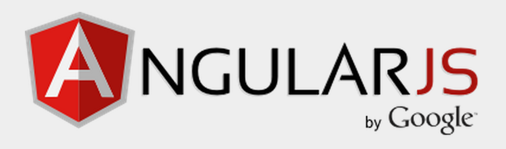
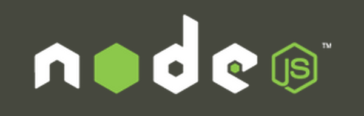
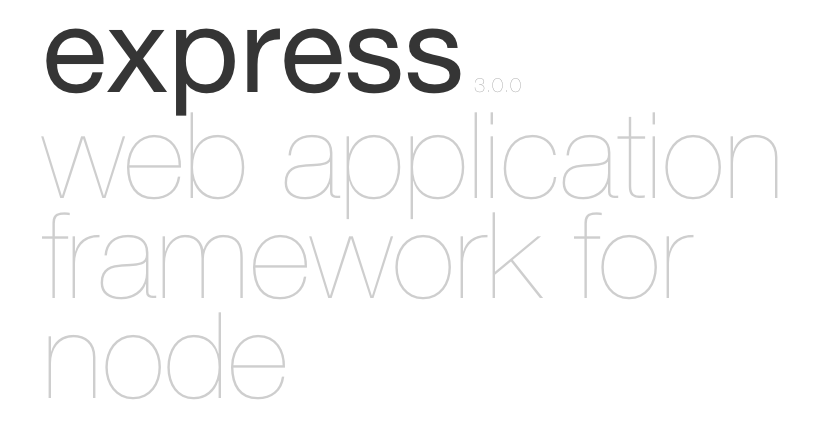

# MEAN Stack 기술

갑작이 떠오른 아이디어를 모바일 서비스로 빠르게 만들고 싶다. 클라이언트/서버/스토어 분야별 전문 개발자를 구하긴 어렵다. 나 홀로 또는 2~3명이 함께 만들어 보고 프로토타입핑하여 시작해 보고 싶을 때 MEAN Stack을 사용해 보자



## 클라이언트단의 "WebApp Framework" 에 대한 고민

클라이언트단의 Android 또는 iOS 네이티브 코드는 익히는데 시간은 없고, 다양한 스마트 기기에 대응을 했으면 한다. 그리고 JavaScript를 어느 정도 할 수 있다. 이때 생각할 수 있는 대안이 "웹앱 사이트" 또는 "모바일 웹앱"을 만드는 것이다. 예전 jQuery 기반으로 개발하기에는 테스트, 유지보수, 개발신속성을 따졌을 때 어려움이 예상된다.

서버단에서 자바의 Spring Framework과 같이 DI(Dependency Injection, 의존성 주입)가 되면서 Spring MVC처럼 코드의 역할을 분할하고 모듈화 개발을 가능하게 해주는 클라이언트단 프레임워크는 없을까? 처음으로 가장 많이 사용하는 클라이언트 MVC 프레임워크로 Backbone.js 가 있다. 예로 메모 서비스인 Trello와 같은 서비스에서 Backbone.js를 기본으로 사용 하고 있다. 그리고 SKT에서 만든 코너스톤(Corner Stone)에도 사용한다. 하지만 B코드의 길이가 길어지고 불필요한 중복 코드가 야기되어 좀 더 간결하면서 예전 Flex Framework과 같은 것은 없을지 고민해 보았다. Flex 프레임워크가 MXML 코드를 해석하여 화면을 구성해 주듯이 HTML 태그를 <line-chart>처럼 확장 사용해도 자동 해석을 하여 브라우져가 이해할 수 있는 HTML로 바꾸어 주고 화면의 제어는 별도의 Controller 자바스크립트에서 제어를 하는 역할이 분리되고 간결한 코딩할 수 있는 그런 프레임워크 말이다. 구글도 이와 유사한 고민을 하고 프로젝트에 적용하고 놀라운 효과를 본 새로운 프레임워크를 공식 런칭하게 되니 이름하여 Angular.js 라 한다. Angular.js 는 화면단의 HTML View 와 화면과의 양방향 제어를 위한 Controller의 코드가 분리되고, 별도의 Listener 등록이 필요없으며 클라이언트단 화면 전환을 위한 프레임워크 차원의 화면 전환 라우팅(Routing) 및 DOM 변경 기술을 자동화 한다. 이를 통해 요즘 유행하고 있는 SPA(Single Page Application) 구현을 손쉽게 하고 있다. 또한 별도의 테스트 프레임워크를 제공하여 Unit 테스트와 End-to-End 테스트 기능을 할 수 있다.




## 서버단의 새로운 "I/O Machine" 에 대한 고민

최근 SI에서 가장 많이 사용하는 자바의 J2EE 스펙 구현체인 WAS안에서 발생하는 Multi-Thread 제어 및 메모리 이슈의 고민을 덜어주고, 모바일 기기에서 채팅 서비스와 같은 것에서 요구하는 Push 기능을 손쉽게 개발할 수 있는 서버는 없을까? Push를 위하여 별도의 Port를 사용하긴 싫고 사용중인 HTTP Port 하나만을 사용하고 싶다면 어떤 서버기술을 선택해야 할까?

서버단이 Java라면 Vert.x도 고려해 볼 만하다. 하지만 아직 레퍼런스와 문서가 부족하고, HTML5의 WebSocket기술을 사용한다. 만일 HTML5가 지원이 안된다면 어떻게 할까? 이런 고민을 해결해 주는 새로운 I/O 머신이 나왔으니 크롬 브라우져의 자바스크립트 해석기인 V8엔진을 기반으로 한 새로운 미들웨어(Middleware) Node.js 이다. Node.js는 V8 엔진에 네트워크 I/O 관련 라이브러리를 추가하여 자바스크립트 기반으로 서버 프로그래밍을 가능하게 하는 미들웨어인 것이다. Node.js를 사용하는 가장 큰 이유 중 하나가 Socket.io와 같은 이벤트 기반의 Push 모듈을 사용하기 위해서 이다. 또한 단일 쓰레드 기반으로 이벤트 기반 Asynch 처리를 함으로 Multi-Thread에 대한 고민을 해결해 준다. 동시 유저수의 처리 수치는 Paypal이 최근 WAS(J2EE)에서 Node.js로 변경하면서 동시접속자수의 처리 성능이 2배 이상 상승하였음을 보여주고 있다. [Paypal 개발자 블로그](https://www.paypal-engineering.com/2013/11/22/node-js-at-paypal/) Node.js는 모듈(Module) 기반 개발을 하며 필요한 모듈을 네트워크를 통하여 중앙서버에서 로컬PC로 추가하여 사용할 수 있다. 이를 위해 NPM(Node Package Manager) 도구가 존재하고 방대한 모듈과 레퍼런스들이 존재한다.




## 스키마에 자유로운 "Store"에 대한 고민

서비스를 빠르게 만들고 싶은데 개발을 진행하다 보면 자주 테이블이 변경되고 이에 맞추어 서버 코드들도 수정을 해주거나 테이블를 변경해야 하는 수정 작업을 한다. 이런 수정 작업없이 스키마에 자유로운 저장소를 사용하고 싶다. 그리고 사용자의 데이터를 많이 쌓아 두어도 서버의 확장이(Scale-out)이 쉬워야 한다. 이왕이면 클라이언트/서버가 모두 자바스크립트이므로 데이터 저장소 제어도 자바스크립트로 하면 좋겠다. 이에 적합한 NoSQL이 MongoDB 이다. JSON형태로 데이터를 저장하고(실제는 Binary JSON인 BSON) 정규화 없이 도큐먼트 형태로 저장을 할 수 있어서 스키마의 제약이 없다. 또한 테라급의 데이터 정도는 MongoDB를 Sharding구조로 만들어 저장 할 수 있고, 자체 내장된 MapReduce 기능을 이용할 수도 있다. 그리고 Node.js 처럼 V8 해석기를 탑재하였기 때문에 데이터 제어를 자바스크립트로 한다. 만일 MongoDB를 사용하게 되면 Client-Server-Store를 자바스크립트로 개발할 수 있게 되므로 단일 언어를 통한 개발이 가능해 진다. 






## Node.js를 기업용 "Web Application Server" 만들기

SUN이라는 회사에서(지금은 오라클에 인수됨) J2EE 스팩을 내놓면서 Tomcat, JBoss, WebSphere, WebLogic, JEUS 같은 Web Application Server(WAS)가 나왔으며, 이 또한 C계열의 TP-Monitor인 Tuxedo, Tmax같은 I/O 머신에 대응하는 Java기반 I/O Machine 이다. 예전 Client-Server 기반의 4GL툴로 개발하고 사용하던 환경에서 인터넷이 보급되면서 새로운 I/O 머신의 요구가 나오게 되었고 자연스럽게 WAS의 사용이 증가한 것이다. Java진영의 WAS는 나름의 공통된 스팩을 기반으로 웹을 이끌어 갈 수 있는 새로운 I/O 머신이 되었고, 기업에서 요구하는 트랜잭션 처리에 대한 스팩도 제안하여 미션크리티컬한 업무에 많이 사용하게 되었다. 최근에는 Tomcat같은 Servlet 엔진만 갖춘 미들웨어 위에 Spring Framework를 사용하여도 충분히 기업용 트랜잭션을 처리하는 업무를 개발할 수 있는 환경까지 오게 되었다. Java의 WAS가 웹1.0의 중심 I/O 머신이었다면 Node.js기반의 I/O Machine이 웹2.0의 요구에 부흥하는 머신이 되기위한 조건은 무엇일까? (WAS는 Java J2EE 스펙구현체의 대명사로 쓰이는 것을 단순 의미만을 사용하여 "Web Applicaton을 운영하는 Server 머신"이라 생각해 보자)

결국 Node.js에서도 Java의 J2EE 스팩과 같은 견고한 스팩이 필요하다. 현재까지는 J2EE와 같은 스팩은 없지만 Java의 Servlet 스팩에 비견할 만한 프레임워크가 나왔으니 그것이 Express.js 이다. 이제 웹2.0의 I/O 머신은 Node.js가 될 것이고, 여기에 웹에 대한 표준 스팩 구현체는-사실 Node.js를 위한 공통된 스팩은 없다- 아니지만 가장 많이 사용하는 Express.js를 통하여 Node.js가 Tomcat과 같은 기능을 보유하게 되었다.

웹2.0의 패러다임은 개방, 공유, 협업에 있다. 이러한 가치를 가장 잘 구현한 예가 구글 서비스들이 아닐까 한다. GMail부터 구글 Docs, 구글 Drive와 같은 서비스들을 개발하기 위해서는 서버의 성능, 확장성, 안정성등 다양한 요구를 충족해야 한다. Node.js 기반위에 Express.js 프레임워크를 사용함으로써 새로운 패러다임에 도전해 보자.




## Angular.js / Node.js + Express.js / MongoDB  사용하기 

  - 자바스크립트만을 가지고 클라이언트/서버를 개발할 수 있다. 그냥 FullStack 개발자가 될 수 있다.
  - Angular.js는 MV* 프레임워크 개발방식 이기 때문에 서버 개발자의 접근이 용이하다. 
  - Angular.js는 [SPA(Single Page Application)](http://en.wikipedia.org/wiki/Single-page_application) 개발 방식으로 지향한다
  - Nde.js를 통해 이벤트기반 Push 기능을 쉽게 적용할 수 있다. 
  - Node.js를 사용하면 멀티 쓰레드 문제를 고민할 필요가 없다. Asynch의 세상에서 놀자.
  - Express.js를 통해 RESTful 웹서비스 하는 I/O 머신을 쉽게 만들 수 있다.
  - MongoDB를 통해 데이터 스키마를 미리 정의하지 않고 에자일하게(신속하게) 개발을 진행할 수 있다.
  - MongoDB를 사용하면 크고 많은 데이터를 저장하고 처리 할 수 있다.



그러나 우리에게 남은 과제는 이것들을 어떻게 배우고 사용하는지 잘 모른다는 것이다. 각자를 심도 있게 배우는 것은 별도의 가이드북을 따로 보길 바란다. 여기서는 실전 서비스를 어떻게 하면 빠르게 만드는 과정을 적어 보려한다. 낮에는 회사에서 업무를 보면서 향후 스타트업을 준비하는 개발자 또는 사람들에게 행복한 가치를 전달하는 서비스를 개발하고 싶은 개발자가 MEAN Stack을 통해 빠르게 런칭할 수 있길 바란다. 그래서 책을 쓰면서 동시에 작은 서비스를 하나 만들어 보려 한다. 책은 가이드이고 그물일 뿐이다. 실제 돌아가는 서비스가 물고기이다. 즉, 실제 서비스를 낚지 못하면 이 책의 가치도 없다고 생각한다. 실제로 이것을 증명해 보이고 싶다.
