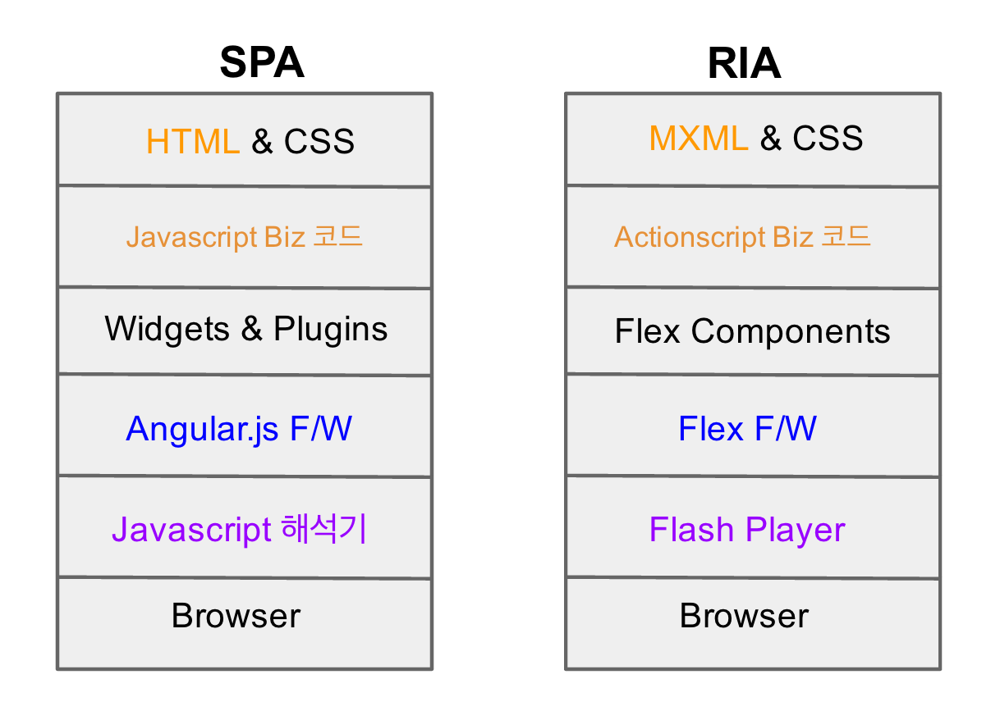

# Angular.js 개요

## Angular.js 가 제시하는 가치

앵귤러는 모던 웹 애플리케이션을 개발하기 위한 프레임워크이다. 복잡하고 단순 반복적인 작업을 대폭 줄여줌으로써 신속한 개발을 가능하게 해준다. 이를 통해 보다 빨리 고객의 피드백을 받고 개선할 수 있는 에자일한 개발 진행이 가능하다. 보다 적은 작업을 통해 보다 더 많은 행복을 주는 프레임워크라고 말하고 싶다. Less Job, More Happy!



1989년 HTML을 시작으로 2005년 Ajax가 나오고 이후 jQuery기반의 DOM 조작을 통한 웹서비스 개발 시대를 거쳐 지속적인 브라우져 기술의 성숙과 자바스크립트 해석기의 성능 향상으로 이제는 자바스크립트를 통해 클라이언트에서도 서버와 같은 MVC 패턴 방식의 애플리케이션 개발이 가능해 지고 있다. 만일 jQuery만을 통해 웹앱을 개발한다고 생각하면 HTML 페이지마다 들어가는 서버 코드와 자바스크립트들의 복잡한 코드에 머리를 쥐어 짤지도 모르겠다.

필자는 13년을 넘게 자바 언어로 서버만을 개발했었고, 가끔 클라이언트단의 jQuery 기반 개발 소스를 볼 때 마다 유지보수가 어려울 것 같은 코들르 목격하곤 했다. 왜일까요? 그것은 서버처럼 잘 정비된 애플리케이션 프레임워크가 없기 때문이 아닐까? JSP, PHP 같은 서버 코드와 자바스크립트 코드 조각을 HTML 사이사이에 끼워 넣는 구조는 복잡성을 증대 시키기 때문이라 생각한다. 그러나 2010년 이후부터 상황은 바뀌어 가고 있고, Backbone.js가 이러한 복잡함을 해결하고자 초기에 클라이언트단 애플리케이션 프레임워크로 나왔다. 이후 Ember.js 그리고 Angular.js 에서 Meteor.js 까지 모던 웹앱을 개발할 수 있는 프레임워크가 나오고 있으며 실리콘벨리에서도 이러한 기술 사용자의 구인이 폭발적으로 늘고 있으며 부르는게 값이라고 한다. 이중 앵귤러가 가장 대중적인 인기와 관심의 대상이 되고 있는데 앵귤러 유독 많은 인기를 누리고 있는 이유는 무엇일까?

Backbonejs 와 Angularjs(노란색) 의 트랜드 변화는 급상승 중



## Angular.js 의 무엇이 개발자를 열광시키는가?

최근 SI시에 서버 개발을 위하여 Spring Framework와 iBatis(myBatis)를 사용하는 것이 기본적인 관례처럼 되었는데 이들의 강점은 무엇일지 생각해 보면

  - DI (Dependency Injection) 을 통하여 코드간의 결합도를 줄여 주고, 테스트 코드의 작성을 쉽게 해준다. 
  - MVC 패턴를 통하여 기본적인 서버 개발의 틀을 가이드 해준다. 
  - 다양한 라이브러리와 툴의 결합으로 개발 생산성을 높여 준다.



스프링 프레임워크의 강점을 클라이언트 단으로 가져오고 싶을 경우 앵귤러 프레임워크를 사용했을 때 이와 같은 이점을 누릴 수 있다.

  - 모듈 및 역할 단위의 DI를 지원한다. 
  - 모듈 단위의 개발로 코드를 간결하게 유지하고 테스트를 쉽게 해준다. 
  - MV* 패턴을 통하여 역할을 나누고 개발을 가능하기 때문에 유지 보수가 쉬워진다. 
  - jQuery의 Plugins 뿐만아니라 기존의 다양한 라이브러리를 앵귤러의 지시자(Directive) 방식으로 수정하면 HTML에서 의미있는 표현으로 사용할 수 있다.
  - 자바의 Maven, Ant 와 유사한 Grunt/Bower툴을 통하여 클라이언트 라이브러리 의존성 관리 및 빌드 자동화가 가능하여 개발 생산성을 높일 수 있다.

하지만 앵귤러를 시작하게 되면 약간의 학습곡선이 존재하며 실제 앵귤러 기반 서비스를 개발한 경험없이 프로젝트에 도입하게 되면 처음에는 많은 고생을 하게 된다. 앵귤러 기반으로 개발한다는 것은 자바스크립트를 가지고 웹페이지가 아니라 웹에서 구동되는 리치(Rich) 애플리케이션을 개발하는 것이다. 따라서 앵귤러 프레임워크 기반 개발 진행시 인식의 전환이 필요하다. 앵귤러는 화면을 조작하는 라이브러리나 프레임워크가 아니라 모던 애플리케이션을 개발하는 프론트엔드 프레임워크이다. 최근에는 이를 SPA(Single Page Application) 개발 방식이라 부른다. 몇해 전 Adobe의 Flex 기술을 통하여 클라이언트 단에 엔터프라이즈 애플리케이션을 개발하는 RIA(Rich Internet Application)가 선풍적인 인기를 누렸다. 하지만 현재 스마트 기기에서 Adobe Flash의 미지원 발표가 있은 후 이제 RIA의 용어는 점점 사라져 가고 있다. 그렇다고 Flex와 같은 사용자 경험이 없어지는 것은 아니라 본다. PC시대의 RIA를 표방한 Adobe의 Flex 프레임워크처럼 PC와 Mobile을 통합하는 자바스크립트기반의 클라이언트단 개발 프레임워크가 앵귤러이다. 즉, 비교에 무리가 있을 수 있지만 이해를 돕기위하여 앵귤러 기반의 SPA와 플래쉬 기반의 RIA를 비교해 보았다 

## Angular.js에는 무엇이 있는가?

견고한 싱글 페이지 웹 애플리케이션(SPA)을 만들기 위하여 앵귤러는 다음과 같은 기능을 제공한다.

  - 모듈 단위 개발을 통하여 글로벌 영역을 오염시키지 않고 개발을 할 수 있도록 한다. 따라서 대규모의 애플리케이션 확장이 가능해 진다. 
 
  - 양방향 데이터 바인딩을 통하여 View(HTML) 와 Controller(자바스크립트) 사이에 데이터에 대한 동기화를 자동으로 수행한다. 즉, View 에서 데이터를 입력하면 Controller 단의 데이터를 업데이트 해주고, 그 반대도 가능해 진다. 기존 jQuery에서는 데이터 동기화를 위하여 Event를 받기 위한 Listener 등록 코드를 모두 코딩해야 했다면 앵귤러에서는 이런 코드를 찾아 볼 수 없다. 
 
  - 앵귤러를 보통 MVW 프레임워크라 부릅니다. W는 Whatever의 의미로 Factory, Service, Directive, Filter 다양한 확장 기능을 제공한다. 역시 가장 중요한 것은 Controller와 View간 Model의 양방향 연동으로 UX를 보다 직관적으로 개발토록 할 수 있게 한다. 
 
  - Controller는 View HTML에서 발생한 이벤트에 따라 Model의 변경 값을 제어하고, Service는 백앤드 서비스 데이터 I/O 통신을 담당합니다. 각 필요한 기능은 DI(Dependency Injection)을 통하여 펑션의 파라미터 주입방식으로 인스턴스를-싱글톤 패턴- 받아서 사용한다. 
 
  - SPA 의 Single Page라는 의미는 최초에 index.html 을 서버로부터 받은 후 부분적인 화면의 변경을 위하여 일부 HTML(Partial HTML)만을 받아 index.html의 특정 영역의 DOM 객체 변경을 통해 View를 바꿔준다. 이후 서버로 부터 받는 것은 View의 컨텐츠 데이터인 JSON 이나 XML 데이터이다. 이렇게 화면의 부분 변경을 위하여 클라이언트단에서 움직이는 Routing 기능을 제공한다. 이를 위하여 클라이언트 템플릿 엔진이 자체 내장되어 있다. 
  - JavaScript(jQuery) + PHP 또는 JSP 코드가 들어간 HTML 이 기존의 코딩 방식이라면 Javascript(Angular) + HTML 만 존재하는 것이 앵귤러의 코딩 방식이다. 즉, HTML안에는 어떠한 자바스크립트 코드도 넣을 필요없이 개발을 하므로 화면에 대한 레이아웃(Layout)만 신경쓰면 된다. 이유는 반복해서 사용하는 HTML 또는 자바스크립트 코드조각이나 위젯/플러그인을 앵귤러만의 컴포넌트로 만들어서 HTML tag, attribute, class, comment 등의 방식으로 HTML에 포함시킬 수 있는 Directives(지시자) 기능을 제공하기 때문이다. Flex의 MXML에 차트관련 컴포넌트를 <Line> 태그로 표현하듯이, 앵귤러의 Directive(컴포넌트)를 만들면 HTML안에 <Line> 과 같은 태그를 포함시킬 수 있다는 것이다. 
  - 백앤드로 Node.js를 사용한다면 Flex의 Messaging 기술과 같은 Push 방식의 구현을 Socket.io 이벤트 방식 코딩을 통하여 보다 더 쉽게 구현 할 수 있다.

참조: [앵귤러의 5가지 장점](http://net.tutsplus.com/tutorials/javascript-ajax/5-awesome-angularjs-features/)

이제 자바스크립트 코딩이 가능하다면 싱글 페이지 애플리케이션(SPA) 에 도전해 보자.
