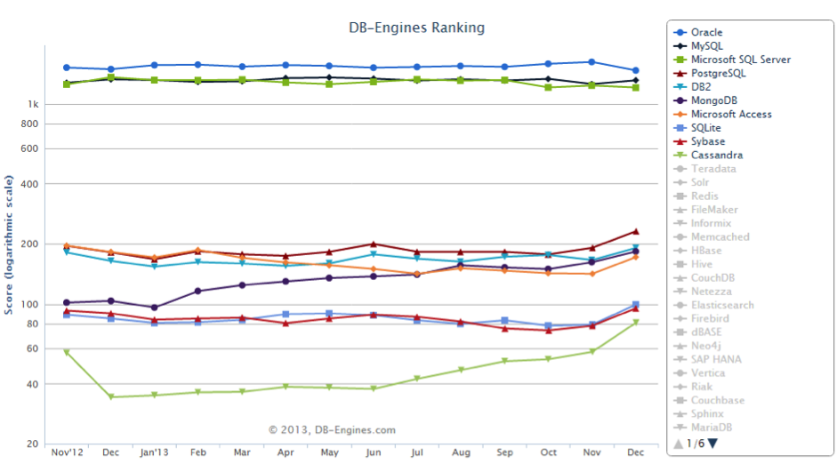
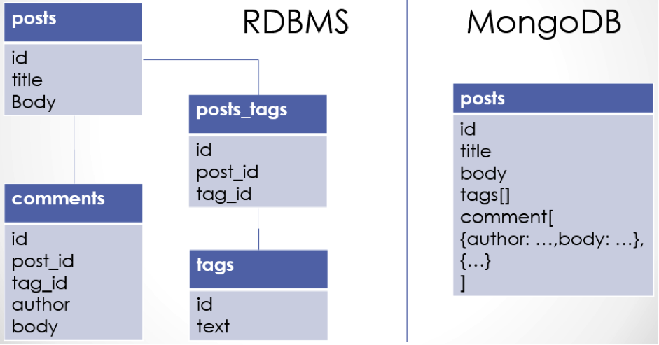
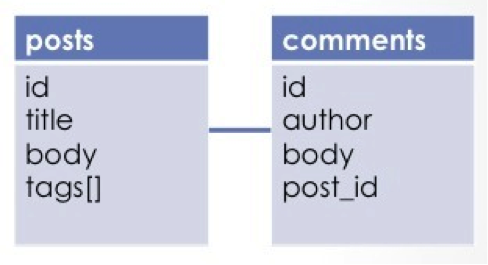
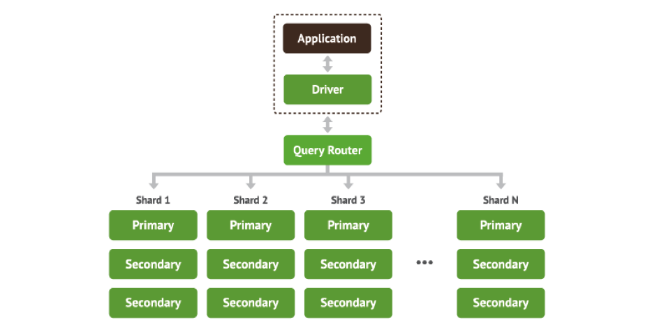

#MongoDB 개요

##왜 MongoDB인가?

DB-ENGINES은 매달 데이터베이스 관리시스템의 인기 순위를 발표한다. 그림 1은 2012년 11월부터 2013년 12월까지 상위 열 개의 데이터베이스 엔진의 점수를 변화를 나타낸 챠트다. 다른 데이터베이스와 달리 MongoDB의 점수는 계속 오르고 있다. 이렇게 MongoDB에 관심이 높아지는 이유는 무엇일까?



###직관적인 데이터 모델

도큐먼트 데이터베이스는 데이터 모델이 풍부하다. ObjectId를 기본키(primary key)로 하며 배열을 값으로 저장할 수 있다. 하나의 도큐먼트 내부에 새로운 도큐먼트를 삽입할 수 있어 계층적인 구조의 데이터를 표현할 수 있다. 관계형 데이터베이스처럼 정규화를 거쳐 테이블을 나누지 않아도 되고 복잡한 조인(join)을 써서 쿼리를 만들 필요가 없다. 따라서 테이블 명세서나 관계 다이어그램 없이 도큐먼트만 조회하여 모델을 쉽게 파악할 수 있다. 

###동적 스키마 

MongoDB는 미리 정해진 스키마 없이 개발이 가능하다. 스키마 변경이 쉬워 애자일 개발에 유용하다. 애자일 개발의 목표는 소프트웨어의 품질향상과 적시성(time to market) 그리고 개발 생산성을 높이는 것이다. MongoDB는 동적인 스키마를 가지고 있어 값비싼 마이그레이션 비용 없이 빠르게 애플리케이션 개발할 수 있다.

###모던 웹

MongoDB는 모던 웹에 잘 맞는다. 모바일 앱과 소셜 네트워크 서비스의 증가로 애플리케이션에서 처리해야 하는 데이터의 양은 계속 증가하고 있다. 최근 애플리케이션은 엄격한 트랜잭션을 보장하는 것보다 빠른 데이터 처리가 더 중요한 경우가 많다. 또한 비정형 데이터 등 다양한 모델이 요구된다. MongoDB는 확장이 쉽고 메모리를 사용하여 빠른 처리가 가능하다.

##MongoDB란 무엇인가?

###도큐먼트 데이터베이스

MongoDB는 도큐먼트 데이터베이스이다. 처음 접하는 독자를 위해 예를 들어 설명하겠다. 아래는 간단한 블로그 애플리케이션의 포스트 도큐먼트다. 아이디(_id)는 기본키이며 ObectId라고 한다. ObjectId는 고유한 값으로 자동으로 생성되며 크기는 12바이트이다. ObjectId는 도큐먼트가 만들어진 시간을 알 수 있는 타임스탬프 값을 포함한다. 기본키는 필요에 따라 개발자가 일련번호와 같은 고유한 키를 만들어 사용할 수도 있다. 태그(tags)처럼 값에 배열을 저장할 수도 있다. 댓글(comments)를 내장(embeded) 도큐먼트로 삽입할 수도 있어 댓글을 저장하기 위해 별도의 테이블을 만들지 않아도 된다. 

```javascript
// 포스트 도큐먼트
{ 
  _id : ObjectId("52ab4ec6dfad251bd0b745ef"),
  title : "What is MongoDB?",
  body : "MongoDB (from 'humongous') is an open-source document database.",
  tags: ["mongodb","document database"],
  comments: [
            {
		author: "Heidi",
            	body: "Awesome post."
            },
            { 
		author: "Eugene",
            	body: "Thanks."
            }
  ] 
}
```

###스키마 디자인

관계형 데이터베이스는 정규화 기법으로 스키마를 설계한다. MongoDB는 데이터뿐만 아니라 애플리케이션에 따라서도 스키마가 달라진다. 그림 2는 블로그 애플리케이션의 관계형 데이터베이스와 MongoDB를 비교한 스키마 디자인이다. MongoDB의 컬렉션(collection)은 관계형 데이터베이스에서 테이블과 역할이 비슷하다. 관례적으로 컬렉션 이름은 복수를 사용한다. 스키마를 “Post”로 정의하고 도큐먼트를 처음 저장할 때 posts라는 컬렉션이 자동으로 만들어진다.



댓글의 수가 많지 않고 항상 댓글이 포스트와 같이 보여진다면 그림 2처럼 모델링하는 것이 좋다. 하지만 댓글의 수가 페이징을 할 정도로 많아지거나 최근 댓글을 별도로 모아서 보고싶다면 그림 3과 같이 comments 컬렉션을 새로 만들어 분리해야 한다. 전자를 임베디드(embeded)라 하고 후자를 레퍼런스(reference)라 한다. 임베디드는 성능이 조금 좋고 레퍼런스 방식은 유연성이 뛰어나다.



객체 지향 프로그래밍을 해 본 경험이 있다면 객체와 관계형 데이터베이스를 연결해주는 ORM(Object-relational mapper)을 써 보았을 것이다. MongoDB의 모델링은 ODM(Object-document mapper)를 이용하여 쉽게 할 수 있다. Node.js용 ODM은 Mongoose가 대표적이다. Mongoose는 MongoDB와의 접속 방법을 제공하고, 모델을 정의하며, 유효성 검사를 할 수 있게 한다.

###확장성

MongoDB는 처음에 구글 앱엔진과 유사하게 PaaS(Platform as a Service)기반으로 설계했다. 클라우드 서비스인 헤로쿠(heroku)를 이용하면 플랫폼 구축 없이도 개발이 가능하다. 규모가 크지 않다면 단일 서버를 구축하여 서비스 할 수도 있다. 변화가 빠르고 불확실성으로 가득한 현시대에서는 최소 기능으로 날씬한 서비스를 만들어 배포하고 고객의 요구사항에 빠르게 대응하여 확장하는 것이 최선이다. MongoDB는 복제(Replication)와 샤딩(Sharding)으로 수평적 확장을 하기 때문에 확장성이 좋다. 복제는 안정성과 높은 가용성을 위하여 사용하고 샤딩은 대용량의 데이터를 여러 서버에 분할하여 효율적으로 처리할 수 있게 한다. 그림 4는 샤딩의 구성을 표현한 것이다. 샤딩시 샤드(Shard)마다 리플리카 셋(Replica Set)을 구성하는 것이 일반적이다.



========

이 장에서는 개발자 관점에서 MongoDB가 왜 매력적인가에 대하여 알아봤다. 또한 대표적인 특정이 무엇인지도 살펴봤다. 이 외에도 풍부한 질의가 가능하고 대용량 파일저장이 쉽다는 장점도 가지고 있다. 하지만 오랜 시간을 거쳐 검증된 관계형 데이터베이스에 비하면 아직 부족한 점이 많다. 무엇보다도 안전성 및 일관성의 보장은 데이터 저장소로써 가장 중요한 항목이기 때문이다. 따라서 개발뿐만 아니라 MongoDB의 운영 및 관리 기술에 대한 이해도 필요하다. MongoDB Inc에서는 온라인으로 학습할 수 있는 DBA과정을 무료로 운영 중이니 꼭 학습하길 권한다.

마지막으로 개발을 시작하기 앞서 주의할 사항이 있다. 첫째 데이터에 개인정보가 있다면 데이터베이스의 사용자 인증을 설정해야 한다. 기본으로 설치할 때 인증절차가 없기 때문에 개인정보유출의 위험이 있다. 둘째 가급적 64bit 운영체제에 설치하기 바란다. 32비트 운영체제는 이론적으로 메모리 한계가 4기가바이트인데 실제 MongoDB가 쓸 수 있는 메모리는 1.5기가바이트가 한계이다. 셋째, 어플리케이션 서버와 분리하여 운영하기 바라며 가급적 복제 셋을 구성하기 권장한다. 단일 서버로 서비스하기 원한다면 데이터 손실을 최소화하기 위한 저널링(Journaling)을 옵션을 사용해야 한다. 64bit용 시스템은 기본으로 저널링을 사용한다.


