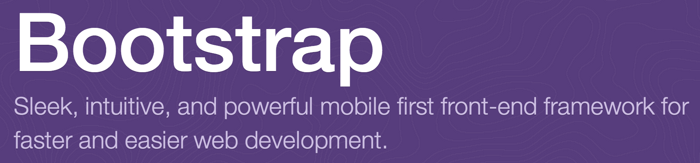

# CSS Framework

개발자들이 가장 힘들어 하는 부분은 UI 개발이라 생각한다. 더 나아가 UX(User eXperience)를 어떻게 UI속에 녹여내어 편의성과 제품의 가치에 맞는 감성을 넣을 수 있을지도 고민해야 한다. 막상 클라이언트 개발을 시작하였을 때 디자이너 또는 기획자의 도움 없이도 완성도 있는 서비스를 만들고 싶다면 기본적인 UX 개념을 이해한 후 그 바탕위에 CSS Framework을 사용해 보자.

최근 추세는 웹의 모양과 색감등 보여지는 부분을 담당하는 CSS를 프레임워크화하여 일관된 UX를 전달해주고 있고 이를 오픈소스로 공개하고 있다. 이중 가장 유명한 것이 트위터 부트스트랩([Twitter Boostrap](http://getbootstrap.com/))이다. 이들 CSS 프레임워크의 특징은 크게 두가지 인데 하나는 반응형 웹 디자인(RWD, Responsive Web Design)이 통합되어 모바일 스마트기기의 해상도에 따라 화면이 최적화되어 표현된다. 둘째는 플랫디자인이다. 구글이나 애플에서 주도를 하고 있고 간결하면서 사용성을 늘린 디자인으로 보인다.

따라서 트위터 부트스트랩을 기본으로 하여 확장한 CSS 프레임워크를 사용하게 되면 '반응형 웹 디자인' 과 '플랫디자인'을 동시에 충족하여 서비스에 적용할 수 있게 된다. 두가지 요소에 대해서는 이곳의 주제와 약간 벗어나므로 좀 더 전문적인 서적을 통해 개념과 상세 기능을 익히기 바란다. 본 서적에서는 선택한 CSS 프레임워크를 어떻게 적용하고 활용하는지를 다룬다.  

## 반응형 웹 디자인 고려

  - Fluid Layout : 화면 사이즈에 따라 배치된 요소들의 정렬을 자동 재배치하는 것이다. 화면이 작아진다고 하여 좌우 스크롤이 생기는 것이 아니라 요소가 밑으로 흘러들어 간다. 이를 위하여 부트 스트랩은 Grid 12 컬럼으로 요소 배치 및 플루이드(Fluid) 정렬을 할 수 있다 
  - Responsive Menu : 부트 스트랩은 상단에 메뉴를 놓고 해상도에 따라 메뉴의 형태를 자동 변경해 준다

서비스 개발이 위의 두가지를 먼저 유념하여 사용하도록 한다. 기본적인 사용법은 [트위터 부트스랩의 홈페이지](http://getbootstrap.com/)를 참조하자.

## 플랫 디자인에 대한 고려

애플은 iOS7에서 플랫디자인을 선보이고, 구글은 전사 서비스를 플랫디자인으로 전환하고 있다. 제품 디자이너가 시각화 단계에서 바라본 플랫디자인의 요소 5가지를(참조) 유념하여 개발자가 UI와 UX를 플랫 디자인으로 진행할 때 고려해야할 사항에 대해 미리 숙지하자 

  - Use of simple elements 심플한 아이콘 : 사각, 원형의 단순 모형에 배치, 컬러, 형태로 표현하여 사용자가 UI 를 쉽게 인식하고 사용토록 만든다 
  - Absence of depth 배제된 효과 : 그림자, 입체감, 그라데이션등의 현실감 있게 하는 3D적 효과를 배제하여 직관적으로 만든다 
  - Typography 타이포그래피 : 화려한 폰트를 배제하고 간결한 폰트를 사용한다. 예) 산세리프 
  - Color 단순한 칼라 : 2~3가지 또는 5~6가지의 색상만을 사용하여 간결하고 과감하게 표현한다. 핑크, 그린, 블루가 대세 
  - Minimalism 미니멀리즘 : 미니멀리즘과 부합 - 간단하고 심플하게 표현으로 다양한 웹, 모바일에 적응이 쉽다

## 서비스 디자인으로 나아가야 한다

서비스을 만들 때 개발자는 어떻게 접근을 하고 있을까요? 아마도 대부분 디자이너, 기획자 또는 웹 퍼블리셔가 만들어준 화면에 코딩을 하는 정도를 경험했으리라 본다. 하지만 자신의 웹앱 서비스를 만들기 시작한다면 단지 디자인이 문제가 아니라 UX라는 사용자 경험을 고려하여 사람과 컴퓨터의 상호작용을 생각해 보아야 하고, 우리가 만들려는 제품의 가치를 서비스에 어떻게 녹여 내야 하는지 연구하고 새롭게 창조하는 과정을 거쳐야 한다. 이를 줄여서 "서비스 디자인"이라고 하며 서비스 개발전 우리가 사용하는 도구와 프레임워크들이 가치를 창출하기 위하여 어떻게 쓰여야 하는지 큰 뷰에서 설명을 해주고 있다. 서비스 디자인을 기반하여 중요한 가치를 찾고 반응형 웹 디자인이나 플랫 디자인이 왜 나왔는지 이해하여 보는 것도 재미날 것같다. 한국디자인진흥원의 [윤성원님이 이야기하는 서비스 디자인 개념](https://www.slideshare.net/usableweb/201301-s) 자료를 한번 보시면 쉽게 이해 되리라 생각한다.

서비스에 일관된 사용자 경험과 가치를 제공하기 위하여 CSS Framework가 나왔고 개념적 바탕은 "서비스 디자인" 임을 인지하고 사용하자. 