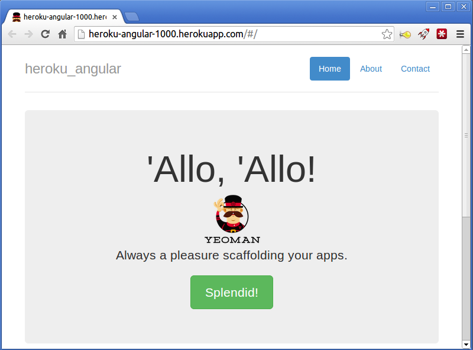

# Heroku

웹서비스를 배포하는 데는 많은 자원이 필요하다. 그 중에서도 가장 중요한 자원이 웹서비스를 운영할 서버로써 과거에는 물리적 하드웨어의 구매부터 장애 관리까지 직접 감당해야했으며 나아가  비스에 필요한 의존성 및 서비스 자체에 대해서도 직접 세팅하고 관리해줄 필요가 있었다. 이러한 서버 자원에 대해서 혁신적인 변화중 하나는 Amazon의 AWS 서비스였다. 특히 Amazon의 EC2는 원하는 만큼 쉽고 빠르게 확장가능한 가상 서버를 제공해 물리적 하드웨어 관리에 대한 부담을 덜어주었다.

Heroku 역시 이러한 Amazon AWS의 강점을 그대로 이용하고 있는 서비스로, 웹서비스 배포를 지원하는 PaaS(Platform as a Service)이다. EC2가 물리적 하드웨어의 관리에서 관리자를 해방시켜준다면, Heroku는 어플리케이션 배포에 필요한 소프트웨어적 환경의 관리로부터 관리자를 해방시켜주는 서비스라고 할 수 있다. 특히 앞서 설명한 내부적으로 어플리케이션을 Git 저장소로 관리할 수 있도록 되어있어, Git 저장소에 특정 구조를 가진 어플리케이션을 가지고 있다면 Heroku Git 서버에 푸쉬하는 것만으로도 어플리케이션 배포가 가능하다. 원래는 루비 온 레일즈 프레임워크를 지원하는 서비스였으나, 현재는 Ruby, Node.js, Python, Java를 지원하며 비공식적으로는 PHP까지 지원하고 있다. Ruby 언어를 만든 마츠모토 유키히로가 치프 아키텍트로 있는 것으로도 유명하다.

## Heroku를 통한 웹 서비스 배포

간단히 Heroku를 통해서 웹 서비스를 어떻게 배포하는지 살펴보도록 하자. 여기서는 yeoman을 angularjs 프로젝트를 생성하고 이 프로젝트를 nodejs의 express 서버를 통해서 배포한다.

먼저 디렉토리를 생성하고 git 저장소를 초기화한다.

```sh
$ mkdir heroku_angular
$ cd heroku_angular
$ git init
$ 
```

다음으로 npm을 통해서 generator-angular를 설치한다. 이를 통해 yo 명령어로 angularjs 프로젝트를 초기화할 수 있다.

```sh
$ npm install -g generator-angular
```

Yeoman을 통해서 angularjs 프로젝트를 초기화한다. 초기화 과정에서 설정을 기본값을 따르며, 각 질문에서 엔터키를 입력한다.

```sh
$ yo angular
Out of the box I include Bootstrap and some AngularJS recommended modules.

[?] Would you like to use Sass (with Compass)? <Enter>
[?] Would you like to include Twitter Bootstrap? <Enter>
[?] Would you like to use the Sass version of Twitter Bootstrap? <Enter>
[?] Which modules would you like to include? (Press <space> to select)
‣⬢ angular-resource.js
 ⬢ angular-cookies.js
 ⬢ angular-sanitize.js
 ⬢ angular-route.js
 <Enter>
```

다음으로 Grunt 명령어를 통해서 프로젝트를 빌드한다. Grunt는 개발중인 angularjs 프로젝트를 배포가능한 형태로 dist 디렉토리에 생성해준다. 아직은 Yeoman을 통해서 생성한 기본적인 요소들만 가지고 있으므로, 실제로 빌드를 거치게 되면 임시 페이지를 볼 수 있다.

```
$ grunt build
```

npm을 통해 프로젝트에 express 패키지를 추가해준다. 여기서 express는 angularjs 프로젝트를 빌드한 static 파일들을 배포하기 위한 서버로 사용된다.

```sh
$ npm install express --save
```

아래와 같이 express 웹 서버 구동을 위한 web.js 파일을 생성한다.

```javascript
var express = require('express');
var app = express();
app.use(express.static(__dirname + '/dist'));
app.listen(process.env.PORT || 5000);
```

이 파일은 Heroku에서 웹서버로 구동된다. 이를 통해 Grunt로 빌드한 dist 디렉토리 아래의 파일들을 웹에서 접근할 수 있도록 해준다.

다음으로 아래와 같이 Procfile을 생성한다. 이 파일에는 Heroku에서 어플리케이션이 어떻게 실행되는지 정의한다.

```sh
web: node web.js
```

마지막으로 지금까지의 변경사항을 저장소에 commit합니다.

```sh
$ git add -f .
$ git commit -m'First commit'
```

이제 Heroku 저장소를 생성하고 Push한다. Heroku에 Push하게 되면 Heroku에서는 자동적으로 지원되는 어플리케이션이 있는지 확인하고 어플리케이션이 작동하도록 적절하게 빌드해준다.

```
$ heroku create heroku-angular-1000
$ git push heroku master
$ heroku start
$ heroku ps:scale web=1
```

Heroku의 어플리케이션 이름은 herokuapp.com 의 서브도메인이 되므로 중복된 이름은 사용할 수 없다. 여기서는 heroku-angular-1000 대신에 사용하고자 하는 도메인을 지정한다.

 

### 
# Nitrous.io
