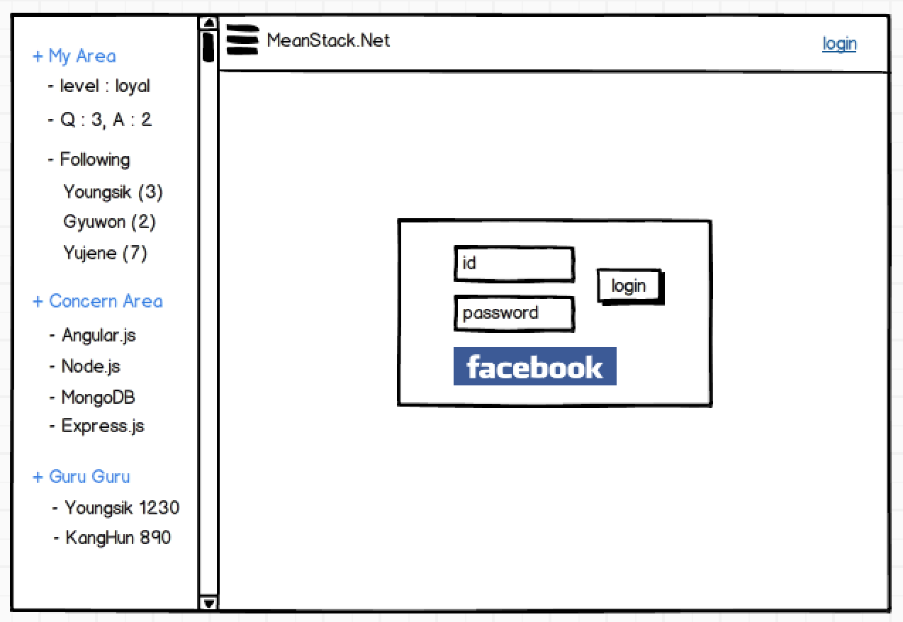
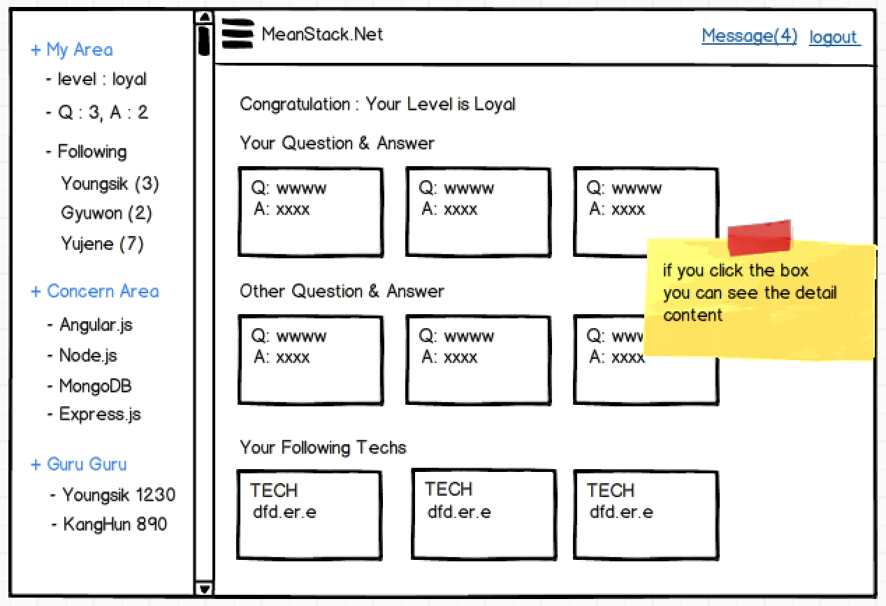
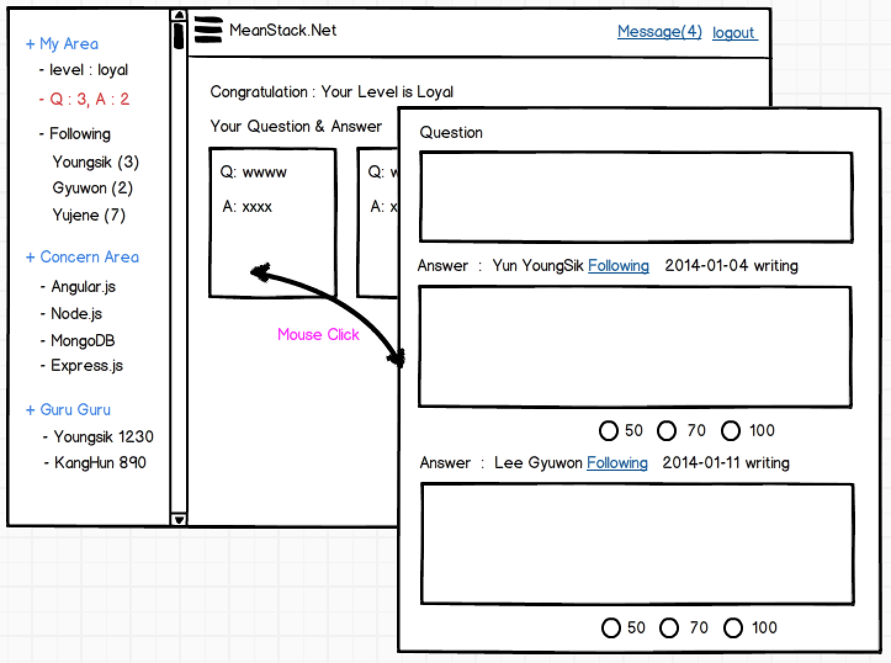
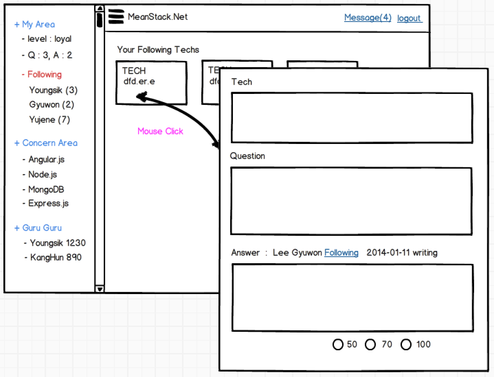
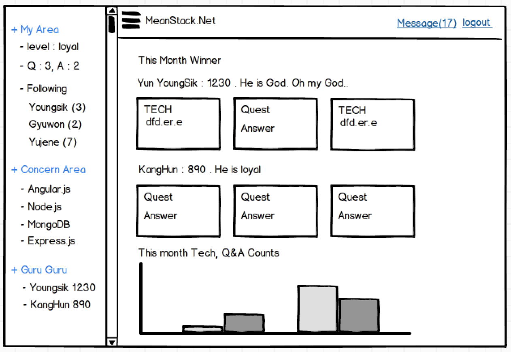

# 서비스 SRS 작성

개인 블로그를 통하여 정보를 공유하는 일에서 한발 더 나아가 함께 글을 올리고 글에 대한 Q&A를 하는 웹앱 서비스를 개발한다. 내가 로그인을 했을 때 처음 보여지는 UI는 SNS 형태이며 내가 올린 질문(Question)에 대한 답변이나 커뮤니티안에서 활동하는 재능 기부자를 팔로잉 하면 해당 글들이 먼저 보여지는 글에 대한 개인화 서비스를 제공한다 

## MEAN Stack 커뮤니트 서비스와 기존 커뮤니티 서비스 비교 

1. 기존 커뮤니티 서비스
  - 특정 재능 기부자가 글을 연재하여 올린다
  - 여러 Q&A 게시판 형태를 취한다  
  - 내가 원하는 것을 Search 하여 찾아 보아야 한다 
  - PC에 최적화 되어있다. 어떤 것은 모바일에서 볼 수도 있다
  - 올라온 글들을 찾아서 읽어야 한다 

2. MEAN Stack 커뮤니티 서비스 
  - SNS 형태를 취하여 모바일기기(Tab, Phone) 중심으로 만들어진다 
  - MEAN Stack에 대한 글을 연재하는 재능 기부 개발자들이 있고, 이중 관심있는 글쓴이를 Following 할 수 있다.
  - 내가 연재글이나 별도의 란에 질문(Question)을 달면 MEAN Stack 재능 기부 개발자들에게 질문이 자동 Notify 된다. 
  - 답변을 준 재능 기부자에게 점수를 통해 고마움을 표현하면 해당 점수는 재능 기부자의 인기도 순위에 영향을 준다.
  - 또한 연재 글에 대해서도 모든 사람은 한번 점수를 줄 수 있다.
  - 인기도는 천민, 일반, 귀족, 왕족, 신(구루) 등의 구분으로 명예의 전당에 공개되고 게임처럼 놀고 싶다. 
  - 해당 인기도는 한달에 한번 reset되고 이달의 구루에겐 모종의 선물을 수여한다.
    답변이나 글연재를 많이 한다고 구루가 되지 않고 해당 답변, 글에 메겨진 점수를 통해 인기도 순위와 등급은 결정된다 
  - 가입한 누구나 특정 분류의 재능 기부자가 될 수 있다 
   
재능 기부하면서 함께 재미 있게 놀고 싶다. 

## MEAN Stack 커뮤니티 서비스 정의

### 서비스의 명칭 
  Community Planet : 새로운 혹성의 커뮤니티. 점수통해 자신만의 영역을 만들어 간다. 우리는 디지털 이주민.
  
### 서비스 UI 목업(Mockup)      

#### 로그인 화면 
  - 등록한 ID/Password를 통한 로그인 
  - SNS 계정을 통한 로그인을 지원한다 

#### 메인 화면 
  - 좌측은 모바일의 Sliding 메뉴로 구성된다 
  - 로그인을 하면 우측 상단에 Push Message 건수와 로그인/로그아웃 링크가 나온다 
  - 중앙에는 내가 질문한 것에 대한 답변과 다른 질문/답변들 그리고 Following 한 재능 기부자들의 글목록이 나온다
  - 글 목록은 핀터레스트 스타일 이다 

#### 질문, 답변
  - 내가 질문한 것과 답변 받은 것을 확인 할 수 있다 
  - 질문내역을 클릭 하면 질문에 대한 답변을 볼 수 있다. 
  - 답변에 대한 점수를 줄 수 있고, 답변이 틀리면 마이너스 점수도 줄 수 있다 

#### 팔로잉한 재능 기부자들의 글 보기
  - 팔로어한 사람별의 최근 글을 볼 수 있다. 내가 관심갖는 글만 보기 
  - 보는 방식은 Q&A화면과 유사하다 
  - 연재글에 역시 질문과 답을 달 수 있다 

 
#### 관심 분야 (Concern Area)
  - 관심영역은 현재 커뮤니티 서비스 관리화면에서 목록을 만들 수 있다. (마치 워드프레스의 관리화면처럼-향후 개발)
  - 특정 관심 영역을 들어가면 해당 영역에서 활동하는 모든 글들을 볼 수 있다.
  - 검색하여 글을 찾을 수 있다 

#### 명예의 전당
  - 이곳은 명예의 전당이다 
  - 가장 점수가 높은 재능 기부자를 상위에 놓고 점수가 높은 순으로 글목록이 나열 된다 
  - 이번달 인기있는 글과 질문 답변에 대해 볼 수 있다 

